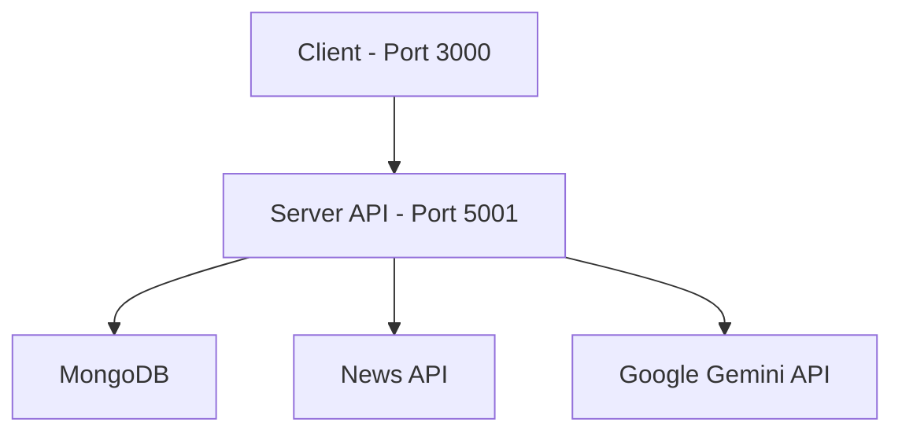

# 📰 Briefly - AI-Powered News Summarization

> A full-stack application for intelligent news aggregation, summarization, and personalized recommendations powered by AI.

[](https://flask.palletsprojects.com/)
[](https://nextjs.org/)
[](https://www.mongodb.com/)
[](https://newsapi.org/)
[](https://www.docker.com/)
[](https://ai.google.dev/)

---

## 📚 Table of Contents

- [📋 Overview](#-overview)
- [✨ Key Features](#-key-features)
  - [🔄 Content Features](#-content-features)
  - [🧠 AI Features](#-ai-features)
  - [👤 User Features](#-user-features)
  - [🔒 Security Features](#-security-features)
- [🛠 Tech Stack](#-tech-stack)
- [🏗 Architecture Overview](#-architecture-overview)
  - [Content Processing Pipeline](#content-processing-pipeline) 
- [🚀 Quick Start](#-quick-start)
  - [Prerequisites](#prerequisites)
  - [Installation](#installation)
- [🔐 Environment Setup](#-environment-setup)
- [📁 Docker Compose](#-docker-compose)
- [💻 Development](#-development)
  - [Building from Source](#building-from-source)
  - [Viewing Logs](#viewing-logs)
  - [Stopping Services](#stopping-services)
- [📞 Support](#-support)

---

## 📋 Overview

Briefly is a modern web application that transforms lengthy news articles into concise, digestible summaries using AI. The platform aggregates content from various sources, extracts key information, and delivers personalized recommendations based on user preferences. Briefly helps users stay informed without information overload.

## ✨ Key Features

### 🔄 Content Features
- News article aggregation from multiple sources
- Article summarization with key points extraction
- Tagged and categorized content for improved discovery
- Search functionality across all articles

### 🧠 AI Features
- AI-powered content summarization with Google's Gemini
- Intelligent tagging and categorization
- Personalized article recommendations based on user likes
- Key points extraction from complex articles

### 👤 User Features
- User authentication and profile management
- Ability to like articles for later reading
- Personalized content feed based on liked articles
- Clean, responsive user interface

### 🔒 Security Features
- Secure user authentication with JWT tokens
- Password hashing with bcrypt
- Route protection for authorized endpoints
- Input validation and sanitization

## 🛠 Tech Stack

| Category | Technologies |
|----------|-------------|
| **Frontend** |    |
| **Backend** |   |
| **Database** |   |
| **Content** |  |
| **AI Services** |  |
| **Authentication** |   |
| **DevOps** |   |

## 🏗 Architecture Overview



The application consists of two main services orchestrated with Docker Compose:

| Service | Description | Port |
|---------|-------------|------|
| **Backend** | Flask API backend | `5001` |
| **Frontend** | Next.js/React frontend | `3000` |

### Content Processing Pipeline

```mermaid
graph LR
    A[News API] -->|"<b style='background:#333; color:white; padding:3px; border-radius:3px;'>Article URLs</b>"| B[BeautifulSoup]
    B -->|"<b style='background:#333; color:white; padding:3px; border-radius:3px;'>Raw Article Content</b>"| C[Gemini AI]
    C -->|"<b style='background:#333; color:white; padding:3px; border-radius:3px;'>Summary & Tags</b>"| D[MongoDB]
    D -->|"<b style='background:#333; color:white; padding:3px; border-radius:3px;'>Personalized Feed</b>"| E[User Interface]
    style A fill:#FFD700,stroke:#B8860B,color:#000000,font-weight:bold
    style B fill:#90EE90,stroke:#2E8B57,color:#000000,font-weight:bold
    style C fill:#FFA07A,stroke:#CD5C5C,color:#000000,font-weight:bold
    style D fill:#87CEFA,stroke:#1E90FF,color:#000000,font-weight:bold
    style E fill:#DDA0DD,stroke:#8A2BE2,color:#000000,font-weight:bold
```



The pipeline combines external data sources, web scraping, AI processing, and database storage:
1. **News API**: Fetches article URLs and basic metadata
2. **BeautifulSoup**: Scrapes full article content from source websites
3. **Gemini AI**: Processes article content to generate summaries, key points, and topic tags
4. **MongoDB**: Stores processed articles and user data
5. **User Interface**: Delivers personalized content based on user preferences

## 🚀 Quick Start

### Prerequisites

- Docker Desktop installed ([Download here](https://www.docker.com/products/docker-desktop/))
- API Keys for:
  - NewsAPI ([Get here](https://newsapi.org/))
  - Google Gemini ([Get here](https://ai.google.dev/))
- MongoDB connection string (local or Atlas) ([Get here](https://www.mongodb.com/products))

### Installation

1. **Clone the repository**
   ```bash
   git clone git@github.com:mikeshuh/CS157C-Team6.git
   cd CS157C-Team6
   ```

2. **Set up environment variables**
   - Create `.env` file in the root directory with the following variables:
     ```
     MONGO_URI=your_mongodb_connection_string
     NEWS_API_KEY=your_news_api_key
     GEMINI_API_KEY=your_gemini_api_key
     JWT_SECRET_KEY=your_jwt_secret
     ```

3. **Start containers**
   ```bash
   docker compose up -d
   ```

4. **Access the application**
   - 🌐 Frontend: http://localhost:3000
   - 🔌 API: http://localhost:5001

## 🔐 Environment Setup

The required environment variables include:

| Variable | Description |
|----------|-------------|
| `MONGO_URI` | MongoDB connection string |
| `NEWS_API_KEY` | API key for NewsAPI |
| `GEMINI_API_KEY` | API key for Google Gemini |
| `JWT_SECRET_KEY` | Secret key for JWT token generation |

## 📁 Docker Compose

```yaml
services:
  backend:
    build:
      context: ./server
    ports:
      - "5001:5001"
    environment:
      - FLASK_APP=app.py
      - FLASK_ENV=development
    command: flask run --host=0.0.0.0 --port=5001
    container_name: briefly-backend-container
    restart: unless-stopped

  frontend:
    build:
      context: ./client
    ports:
      - "3000:3000"
    environment:
      - NEXT_PUBLIC_API_URL=http://localhost:5001
    depends_on:
      - backend
    container_name: briefly-frontend-container
    restart: unless-stopped
```

## 💻 Development

### Building from Source
```bash
# Build all services
docker compose build

# Build specific service
docker compose build backend
docker compose build frontend
```

### Viewing Logs
```bash
# All services
docker compose logs -f

# Specific service
docker compose logs -f backend
```

### Stopping Services
```bash
# Stop all services
docker compose down
```

## 📞 Support

For assistance or to report issues, please open an issue on GitHub.

---

<div align="center">
  <strong>Made with ❤️ by CS157C Team 6</strong>
</div>
